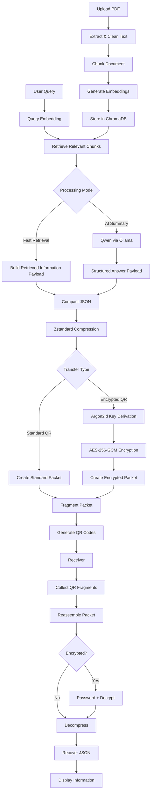

SecureRAG-QR is a local-first document intelligence and secure QR transfer system. It lets a user upload a PDF, retrieve relevant information from the document, optionally summarize it with a local LLM, compress the result, optionally encrypt it, encode it into one or more QR codes, and recover the information on the receiver side.

The project is designed as an MCA project/demo system with a focus on **RAG, local AI, compression, encryption, QR-based offline transfer, and receiver-side reconstruction**.

## Key Features

- PDF upload and text extraction
- Text cleaning and chunking
- Local semantic embeddings
- ChromaDB vector search
- Two processing modes:
  - **Fast Retrieval** — skips the LLM and directly uses the most relevant retrieved chunks
  - **AI Summary** — uses a local Qwen model through Ollama to generate a concise structured answer
- Two transfer modes:
  - **Standard QR** — compressed but not encrypted
  - **Encrypted QR** — compressed and protected with password-based AES-256-GCM encryption
- Automatic QR fragmentation when the payload is too large for a single QR code
- Custom QR receiver
- Multi-fragment reconstruction
- Password-based recovery for encrypted transfers
- Support for both Fast Retrieval and AI-generated payloads
- No paid AI API required
- Local-first architecture

## How It Works



## Processing Modes

### Fast Retrieval

Fast Retrieval is designed for low-latency usage and live demonstrations.

```text
Query
→ Embedding
→ ChromaDB retrieval
→ Relevant chunks
→ Compact payload
→ Compression
→ Optional encryption
→ QR
```

It does **not** call Ollama.

### AI Summary

AI Summary uses the retrieved chunks as context for a local Qwen model.

```text
Query
→ Embedding
→ ChromaDB retrieval
→ Relevant chunks
→ Qwen via Ollama
→ Answer + Facts + Source Chunks
→ Compression
→ Optional encryption
→ QR
```

This mode provides a more concise generated answer but may be slower on machines with limited memory.

## Transfer Modes

### Standard QR

The structured payload is compressed and encoded into QR code(s) without encryption.

Anyone with a compatible decoder can recover the content.

### Encrypted QR

The payload is:

1. Compressed with Zstandard
2. Protected using a password-derived key
3. Encrypted with AES-256-GCM
4. Encoded into one or more QR codes

The receiver must provide the correct password before the information can be recovered.

## QR Receiver

The custom receiver supports:

- QR image upload
- Multi-fragment transfers
- Fragment progress tracking
- Duplicate fragment handling
- Standard transfer recovery
- Encrypted transfer recovery
- Password validation
- Fast Retrieval payloads
- AI Summary payloads
- Older AI-generated payload compatibility

The receiver does not require the original document, embeddings, ChromaDB, or Ollama to recover an already-generated QR transfer.

## Tech Stack

### Backend

- Python 3.12
- FastAPI
- Uvicorn
- PyMuPDF
- Sentence Transformers
- `BAAI/bge-small-en-v1.5`
- ChromaDB
- Ollama
- Qwen3:4B
- Zstandard
- Argon2id
- AES-256-GCM
- QRCode / Pillow

### Frontend

- React
- TypeScript
- Vite
- Axios

## Embedding Model

The project uses:

```text
BAAI/bge-small-en-v1.5
```

Embedding dimension:

```text
384
```

## Local LLM

AI Summary mode currently uses:

```text
qwen3:4b
```

through Ollama.

No paid API is required.

## Project Structure

```text
SecureRAG-QR/
├── backend/
│   ├── app/
│   │   ├── api/
│   │   │   ├── documents.py
│   │   │   ├── query.py
│   │   │   ├── receiver.py
│   │   │   └── transfer.py
│   │   ├── compression/
│   │   ├── crypto/
│   │   ├── ingestion/
│   │   ├── llm/
│   │   ├── qr/
│   │   ├── rag/
│   │   ├── main.py
│   │   └── transfer_store.py
│   ├── storage/
│   │   ├── chroma/
│   │   ├── documents/
│   │   └── qr/
│   └── requirements.txt
│
├── frontend/
│   ├── src/
│   │   ├── components/
│   │   │   ├── DocumentUpload.tsx
│   │   │   ├── QueryDocument.tsx
│   │   │   └── QRReceiver.tsx
│   │   ├── services/
│   │   │   └── api.ts
│   │   └── App.tsx
│   └── package.json
│
└── README.md
```

## Setup

### 1. Clone the repository

```bash
git clone https://github.com/harshitjoshi1706/SecureRAG-QR.git
cd SecureRAG-QR
```

### 2. Backend setup

```bash
cd backend
python3.12 -m venv venv
source venv/bin/activate
pip install -r requirements.txt
```

### 3. Frontend setup

```bash
cd ../frontend
npm install
```

### 4. Install Ollama

Ollama is only required for **AI Summary** mode.

After installing Ollama, pull the model:

```bash
ollama pull qwen3:4b
```

## Run the Project

### Terminal 1 — Ollama

Only needed for AI Summary mode.

```bash
ollama serve
```

### Terminal 2 — Backend

```bash
cd SecureRAG-QR/backend
source venv/bin/activate
uvicorn app.main:app --reload --host 0.0.0.0 --port 8000
```

Backend:

```text
http://127.0.0.1:8000
```

Swagger API documentation:

```text
http://127.0.0.1:8000/docs
```

### Terminal 3 — Frontend

```bash
cd SecureRAG-QR/frontend
npm run dev -- --host 0.0.0.0
```

Frontend:

```text
http://localhost:5173
```

> If you only want to use **Fast Retrieval**, Ollama can remain completely stopped.

## Usage

### Sender

1. Open the Sender page.
2. Upload a PDF.
3. Wait for the document to be processed.
4. Enter a question.
5. Select:
   - **Fast Retrieval**, or
   - **AI Summary**
6. Select:
   - **Standard QR**, or
   - **Encrypted QR**
7. Enter a password if Encrypted QR is selected.
8. Generate the response.
9. Generate the QR code(s).

### Receiver

1. Open the Receiver page.
2. Upload each QR image belonging to the transfer.
3. Wait until all fragments are received.
4. If encrypted, enter the original password.
5. Click **Recover Information**.
6. The reconstructed information is displayed.

## Example Payloads

### Fast Retrieval

```json
{
  "mode": "fast",
  "query": "Which chunking strategy was most robust?",
  "retrieved_information": [
    {
      "chunk_number": 12,
      "text": "Relevant information retrieved from the document..."
    }
  ],
  "source_chunks": [12]
}
```

### AI Summary

```json
{
  "mode": "ai",
  "answer": "A concise answer generated from the retrieved context.",
  "facts": [
    "Supporting fact one.",
    "Supporting fact two."
  ],
  "source_chunks": [12, 18]
}
```

## Security Design

Encrypted transfers use:

```text
Password
↓
Argon2id
↓
256-bit key
↓
AES-256-GCM
↓
Encrypted payload
```

AES-GCM provides both confidentiality and integrity protection.

Passwords should not be hardcoded or logged.

## Why QR Fragmentation?

QR codes have limited capacity.

If a compressed/encrypted payload is larger than the configured fragment size, SecureRAG-QR splits the packet into multiple fragments.

Each fragment contains metadata such as:

```json
{
  "version": "SRQ1",
  "transfer_id": "...",
  "fragment_index": 1,
  "fragment_total": 3,
  "payload": "..."
}
```

The receiver collects the fragments and restores them in the correct order.

## Protocol

Current protocol identifier:

```text
SRQ1
```

The protocol distinguishes between standard and encrypted transfers.

## Current Limitations

- AI Summary with Qwen3:4B can be slow on low-memory hardware.
- Fast Retrieval is recommended when low latency is important.
- Prepared transfer state may currently depend on the running backend process if in-memory storage is being used.
- The receiver application is custom to the SecureRAG-QR packet format.
- Standard QR mode does not provide confidentiality.
- This project is an academic/prototype system and should be security-reviewed before use with sensitive real-world data.

## Future Improvements

- Persistent SQLite transfer storage
- AI response caching
- Faster/smaller local LLM option
- Fully browser-side offline receiver
- Live camera QR scanning
- Transfer expiry and cleanup
- Better QR capacity optimisation
- OCR support for scanned PDFs
- Persistent document metadata
- Authentication and user accounts
- Automated test suite
- Docker deployment

## Main Use Cases

- Secure document knowledge transfer
- Offline transfer of compact information
- Local-first document question answering
- QR-based transfer in restricted-connectivity environments
- Educational demonstration of RAG + compression + cryptography + QR reconstruction

## Academic Context

SecureRAG-QR demonstrates the integration of:

- Information Retrieval
- Retrieval-Augmented Generation
- Local Large Language Models
- Vector Databases
- Data Compression
- Password-Based Key Derivation
- Authenticated Encryption
- QR Encoding
- Fragmentation and Reconstruction
- React/FastAPI full-stack development

## Author

**Harshit Joshi**

GitHub: [harshitjoshi1706](https://github.com/harshitjoshi1706)

---

If you find the project useful, consider starring the repository.
"""

path = Path("/mnt/data/README.md")
path.write_text(readme, encoding="utf-8")
print(f"Created {path}")
